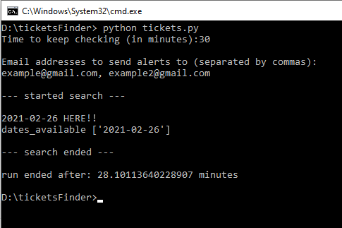

# Hermon Tickets Finder
*ticketsFinder* is a Python script that looks for available tickets for Mount Hermon
and sends an alert in Real-Time to all the emails interested.

## How it works:
Upon execution, the script asks for how many minutes the program should be running.
Then the program asks for the email addresses to send alerts to.
After giving the needed parameters, the script starts searching for tickets.

Every fixed amount of seconds, using selenium, the script gets the HTML of the tickets page.
The HTML is parsed using BeautifulSoup, and the script checks whether there are dates with available tickets.
If so, the script sends an email to the email addresses specified, to notify about the tickets.
Afterwards, the script sleeps for a fixed amount of time, and does the same process again.

## Setup before run:

### Installations:
**Libraries used:**
* Selenium
* Beautiful Soup
* PyYAML

```shell
pip install -r requirements.txt
```
#### Selenium setup:
The script works with selenium Firefox, so Firefox needs to be installed.
In order to work with the selenium firefox-geckodriver, it needs to be installed:

**Linux:**
```shell
sudo apt install firefox-geckodriver
```

**Windows:**\
The selenium firefox-geckodriver can be installed [here](https://github.com/mozilla/geckodriver/releases/tag/v0.29.0).\
After installing and extracting the geckodriver.exe, copy it into one of your System paths.

### Code setup:
The program sends alerts to the emails specified in the beginning of the run.\
So before running the script, you need to fill in a working email address and a password for the email address you want the program to send the alerts from.

Change the following lines in the `config.yaml` file: (lines 2-3)
```yaml
# ===== Email settings =====
email_address: example@mail.com
email_password: password_example
```

 
## Running the script:
After the setup, now you can run the python script.
You can specify the time you want for the script to run and the email addresses you want to be notified in the command line arguments.
```shell
# Run the script for 10 minutes, and send alerts to: example.1@mail.com, example.2@mail.com
./tickets.py --time=10 --recipients="example.1@mail.com, example.2@mail.com"

# The same as above, but shorter
./tickets.py -t 10 -r "example.1@mail.com, example.2@mail.com"
```
You can use the `-v` or `--verbose` option for a more verbose output, and `-h` or `--help` to see the help list.
In addition, you can edit the default values for all the command line options in the `config.yaml` file.
That way you will be able to run the script without any additional arguments specified.

That's it!
Have fun skiing in the Hermon :)

## Run example:


